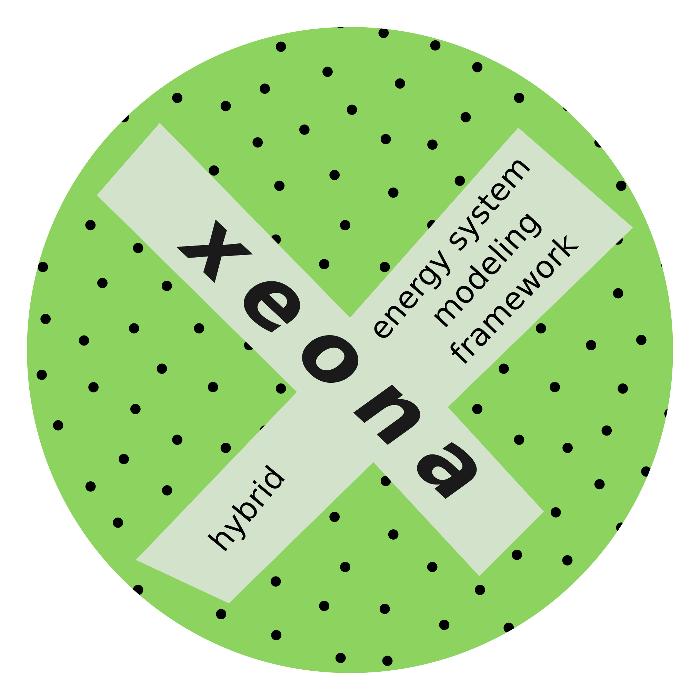
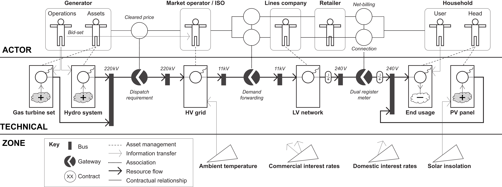
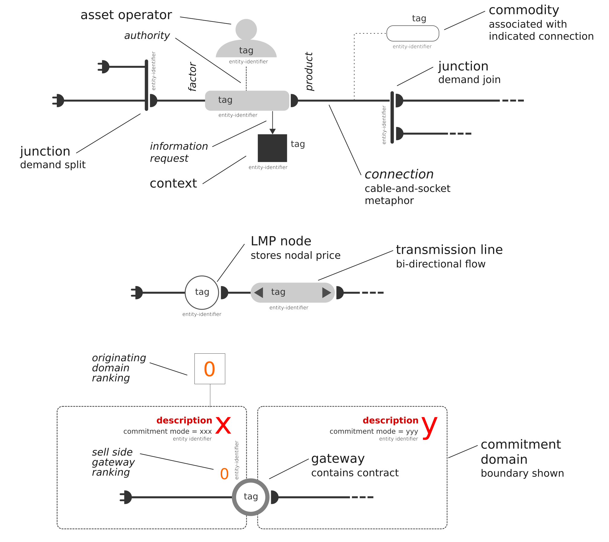

<!--
  author    : Robbie Morrison
  commenced : December 2017
  license   : this work is licensed under a Creative Commons Attribution 4.0 International License
-->

# *xeona*

*xeona* is a **modeling environment** for energy systems that supports **multi&#8209;party operations**, least&#8209;cost **market clearing**, and capacitated **network effects** endogenously &nbsp;&mdash; plus **structural change** exogenously through **scenarios**.

*xeona* was completed in 2014, at which point active development ceased.

The source code, documentation, and development data are deposited here as an historical record.

## Overview

*xeona* represents one of the earlier attempts to combine **agent&#8209;based modeling** with classical optimization&#8209;based **energy system modeling**.

*xeona* relies on object&#8209;oriented design and analysis (OODA) and was necessarily written from the ground&nbsp;up in a high&#8209;performance general&#8209;purpose programming language.

<figure style="margin-top: 4.0ex; margin-bottom: 2.0ex; text-align: center">
  
  <!-- 
&nbsp;
 -->
  <!-- <figcaption><b>Figure&nbsp;1</b>: Key components divided into three realms</figcaption> -->
</figure>

**Figure&nbsp;1**: Key components divided into three realms

*xeona* offers a&nbsp;clear separation of responsibilities between technical characterizations, operator decisioning, and market&#8209;based dispatch.  Figure&nbsp;1 shows the general arrangements.  The design of *xeona* includes the following features:

- high&#8209;resolution technical modeling
- physical network effects
- agent&#8209;based decisioning
- contractual relationships (considered structural)
- simplified locational marginal pricing (*aka* nodal pricing)
- structural change via exogenous scenarios

The system itself did not look ahead but the agents can&nbsp;&mdash; just as in real life.

<figure style="margin-top: 4.0ex; margin-bottom: 2.0ex; text-align: center">
  
  <!-- 
&nbsp;
 -->
  <!-- <figcaption><b>Figure&nbsp;2</b>: Some design features shown schematically</figcaption> -->
</figure>

**Figure&nbsp;2**: Some design features shown schematically

The system is divided into commitment domains and *xeona* provides a novel way of traversing the system at each time&nbsp;step, capacitating and solving the system incrementally until a complete solution is realized.  Figure&nbsp;2 shows two commitment domains separated by a gateway entity. The diagram also depicts the&nbsp;plug metaphor that wires the system and defines notional demand flow.

*xeona* was designed to study [sector&#8209;coupling](https://en.wikipedia.org/wiki/sector_coupling) specifically and system integration under distributed decision-making more generally&nbsp;&mdash; both emerging topics when the software was conceived.

## Implementation

*xeona* was written as production software.

*xeona* was implemented using 58&thinsp;000 source lines of C++ with ancillary processing and visualization coded in R and bash.

The source code is licensed under the GNU&nbsp;GPLv3+ license and the documentation and data are under the Creative Commons CC&#8209;BY&#8209;4.0 licenses.

## Publications

Directly related publications:

- Morrison, Robbie, Tobias Wittmann, Jan Heise, and Thomas Bruckner (2005).  In Kjelstrup, Signe, Johan&nbsp;E Hustad *et&nbsp;al* (editors).  [*Chapter: Policy-oriented energy system modeling with 'xeona'*](https://www2.wifa.uni-leipzig.de/fileadmin/user_upload/iirm-tm/energiemanagement/publikationen/Conference_Proceedings/2005_PolicyOrientedEXeona.pdf).  Trondheim, Norway: Tapir Academic Press.  pp 659–668.  ISBN 82-519-2041-8.  Conference held Norwegian University of Science and Technology (NTNU) on <nowrap>20–22 June</nowrap> 2005.

- Bruckner, Thomas, Robbie Morrison, and Tobias Wittmann (2005).  "Public policy modeling of distributed energy technologies: strategies, attributes, and challenges".  *Ecological Economics*.  **54**&nbsp;(2–3):&nbsp;328–245.  ISSN [0921-8009](https://www.worldcat.org/issn/0921-8009).  doi:[10.1016/j.ecolecon.2004.12.032](https://doi.org/10.1016/j.ecolecon.2004.12.032).

- Morrison, Robbie, Tobias Wittmann, and Thomas Bruckner (2004).  [*Energy sustainability through representative large-scale simulation: the logical and physical design of 'xeona'*](https://www.thesustainabilitysociety.org.nz/conference/2004/Session5/37%20Morrison1.pdf).  Auckland, New Zealand: International Conference on Sustainability Engineering and Science (ICSES).  Conference held Sheraton Auckland on <nowrap>6–9 July</nowrap> 2004.

- Morrison, Robbie (14&nbsp;October 2010).  [*Core codebase of the xeona energy systems modeling environment — revision 5314*](https://zenodo.org/record/4817704/files/xeona.r5314.code0.pdf).  doi:[10.5281/zenodo.4817704](https://doi.org/10.5281/zenodo.4817704).  PDF version.  Zenodo upload 27 May 2021.  Contains 197&nbsp;source files and circa 58&#8239;000 source lines of code of C++.  1164&nbsp;pages.

 

 Copyright (c) Robbie Morrison This file is licensed under a <a rel="license" href="http://creativecommons.org/licenses/by/4.0/">Creative Commons Attribution 4.0 International License</a>.

Text last modified <nowrap>10 April 2025</nowrap>.

&#9634;

<!-- eof -->
